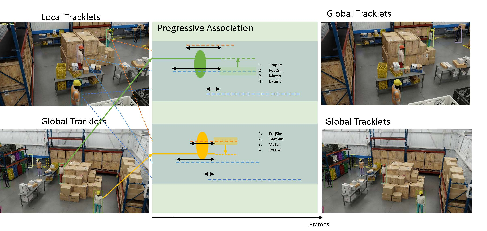

# Glance-MCMT: A General MCMT Framework with Glance Initialization and Progressive Association [[paper link](https://arxiv.org/abs/2507.10115)]


## Explanation
I tried to provide a simple solution for MCMT tracking framework for 
 [[AI City Challenge 2025 Track1](https://www.aicitychallenge.org/2025-track1/)]

The idea is simple and works based on progressive association, while an initial global ID association (I call it glance association) is conducted at first.
This solution is not probably the best solution, while I guess it is the simplest one :D

## Dataset Availability

The official dataset can be downloaded from the AI City Challenge website (https://huggingface.co/datasets/nvidia/PhysicalAI-SmartSpaces/tree/main/MTMC_Tracking_2025). 


## Overall Pipeline


 


## Environment Requirements

The implementation of our work is built upon [BoT-SORT](https://github.com/NirAharon/BoT-SORT) and [torchreid](https://github.com/KaiyangZhou/deep-person-reid).
Special thanks to [YACHIYO_RIIPS](https://github.com/riips/AIC24_Track1_YACHIYO_RIIPS) that our code is build upon their version.

Three different environments are required for the reproduction process. Please install these two environments according to the following repos:
<a name="install"></a>
1. [Install BoT-SORT for people detection](https://github.com/NirAharon/BoT-SORT#installation)
2. [Install torchreid for feature extraction](https://github.com/KaiyangZhou/deep-person-reid#installation)
3. Install Torch 

```

conda install pytorch torchvision -c pytorch

```

Once you installed above to the same machine, you'll see the root folder organized as follows:
```
root
│  README.md
│  overall-pipeline.png
│
├─AIC25_Track1
├─assets
├─detector
├─embedder
├─scripts
├─tools
├─tracking
├─TrackEval
│
├─BoT-SORT
└─deep-person-reid
```

## Training 
This project executes
1) YOLOX retraining (Import the YOLOX version used in [ByteTrack](https://github.com/FoundationVision/ByteTrack)) and retrain on the dataset
2) Target detection using retrained YOLOX
2) Feature extraction of each target


I'll utilize pre-trained model for reidentification.

## Running Tracking

### Preparation
#### 0. Place your data files.

Place your video files to under directory that corresponds to AIC25_Track1/Train, AIC25_Track1/Val and AIC25_Track1/Test such as `AIC25_Track1/Test/Warehouse_017/videos/Camera/Camera.mp4`. Or `AIC25_Track1/Val/Warehouse_016/videos/Camera_01/Camera_01.mp4`


#### 1. Frame Extraction

Run a command below to extract frame images. (add a similar file for the test)
```
source extract_frame_val_25.sh
source extract_frame_train_25.sh
```

#### 2. Person Detection

Run steps below for person detection.
- Install BoT-SORT as instructed in Environment Requirement section above [here](#install).
- Prepare Models. Download the pretrained YOLOX_x model from [ByteTrack [Google Drive]](https://drive.google.com/file/d/1P4mY0Yyd3PPTybgZkjMYhFri88nTmJX5/view), and store it to BoT-SORT directory after retraining it on the training set (follow the instruction provided in ByteTrack for retraining YOLOX). See `scripts/train_detector.sh` for example.
- Run person detection by executing a command below.
```
source scripts/detection_25.sh
```

#### 3. Feature extraction

Run steps below to get feature extraction.
- Install deep-person-reid as instructed in Environment Requirement section above [here](#install).
- Prepare Models. Download the pretrained deep-person-reid model from [torchreid](https://kaiyangzhou.github.io/deep-person-reid/MODEL_ZOO). By running a script mentioned below will download this pretrained model automatically and will store it accordingly.
- Run feature extraction by executing a command below.
```
source scripts/embedding_25.sh
```


### Single Camera Tracking and Multi Camera Tracking

#### 4. Single Camera Tracking
- Copy `BoT-SORT/tools/utils_25_revised.py`, `BoT-SORT/tools/utils_25.py`, `BoT-SORT/single_camera_tracking.py`, `BoT-SORT/single_camera_fix.py`, `BoT-SORT/multi_camera_revised.py` and `BoT-SORT/multi_camera_fix.py` into `BoT-SORT`
Run command steps below to run Single Camera Target Tracking
```
python3 -m venv .venv
source .venv/bin/activate
pip install -r tracking/requirements.txt
source scripts/single_tracking_25.sh
source scripts/single_tracking_fix_25.sh
```

#### 5. Multi Camera Tracking

Run command below to run Multi Camera Target Tracking
```
source scripts/multi_tracking_25.sh
python BoT-SORT/multi_camera_fix.py 
```

#### 6. Evaluation
I have adapted the [TrackEval](https://github.com/JonathonLuiten/TrackEval) repository such that it evaluates 3D HOTA metric for 3D bounding boxes.
For more details see:
`from trackeval.datasets.aicity_3d import AICity3D`

Also you can use
`TrackEval\main.py`
To evaluate your final generated txt files.
